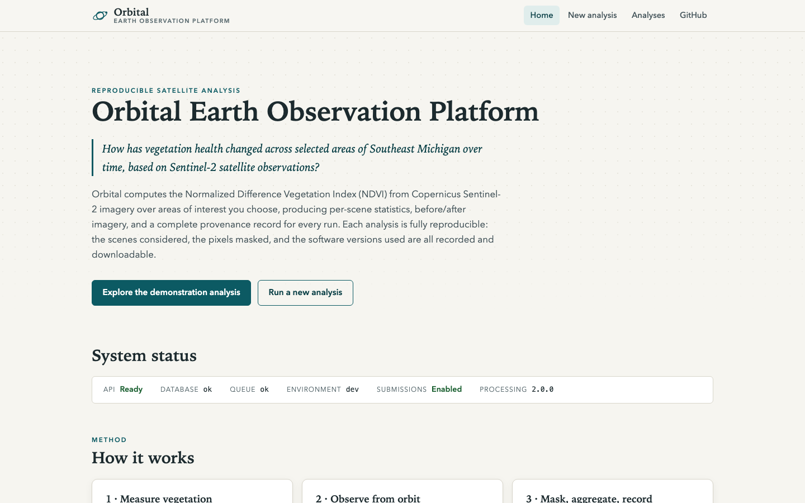
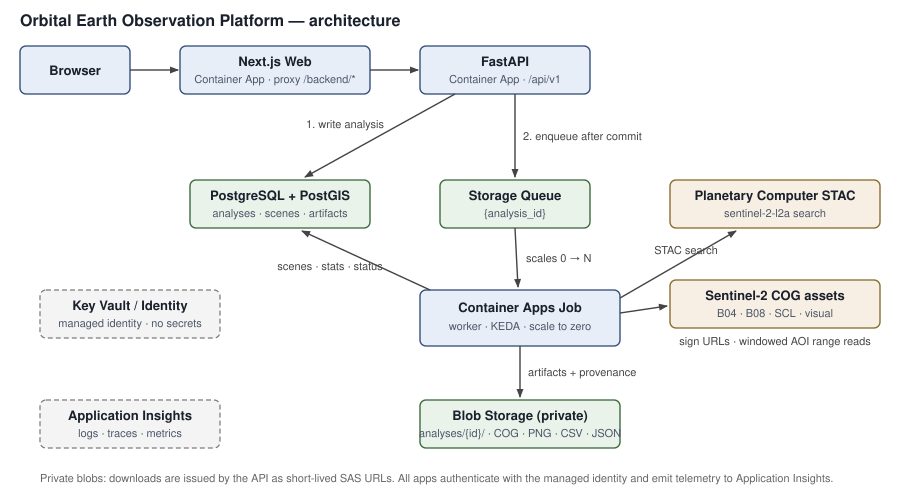
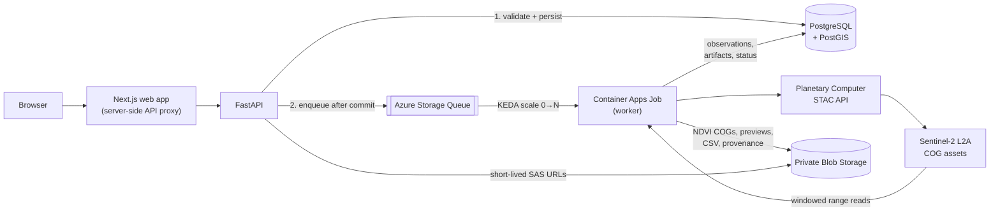

# Orbital Earth Observation Platform

**How has vegetation health changed across selected areas of Southeast Michigan
over time, based on Sentinel-2 satellite observations?**

A reproducible environmental observation platform that turns that question into
auditable measurements: it discovers Sentinel-2 scenes through the Microsoft
Planetary Computer STAC API, applies documented cloud masking, computes NDVI
over user-selected areas of interest, and publishes every result with
machine-readable provenance — from the exact source scenes and mask policy down
to the SHA-256 of every output file.





## What it does

- **Interactive analyses** — pick a predefined Michigan region or draw a small
  area, choose a date range and cloud-cover threshold, and submit. The API
  queues the work; an event-driven worker processes it and the UI tracks
  `queued → running → succeeded/failed` live.
- **Real science, efficiently** — only the raster windows covering your AOI are
  read from cloud-optimized GeoTIFFs (no full-scene downloads). The Scene
  Classification Layer masks clouds, shadows, cirrus, and snow under a
  documented, configurable policy, and the Sentinel-2 processing-baseline
  reflectance offset is handled explicitly (it does *not* cancel in the NDVI
  ratio).
- **Deterministic scene selection** — when more scenes match than the limit, a
  documented temporal-stratified lowest-cloud algorithm picks the set, and
  every excluded scene is recorded with its reason.
- **Full provenance** — each analysis ships a JSON provenance document
  (validated against a published schema) with STAC item IDs, unsigned asset
  references, mask classes, band scaling, software versions, git commit,
  container image, CRS/transform per output, checksums, and timings.
- **Downloadable outputs** — per scene: float32 NDVI Cloud Optimized GeoTIFF
  (rio-cogeo validated), colorized NDVI preview, source true-color preview,
  summary JSON; per analysis: time-series CSV (actual observation dates, never
  interpolated), summary JSON, provenance JSON.

> **Interpretation note** — results are *observed spectral vegetation-index
> changes* for specific acquisition dates. NDVI alone does not establish
> drought, wildfire damage, climate change, or agricultural failure. See
> [docs/limitations.md](docs/limitations.md).

## Data source

[Sentinel-2 Level-2A](https://planetarycomputer.microsoft.com/dataset/sentinel-2-l2a)
surface reflectance (ESA / Copernicus), accessed via the Microsoft Planetary
Computer STAC API. Bands used: B04 (red, 10 m), B08 (NIR, 10 m), SCL (scene
classification, 20 m), and the true-color composite for previews.

*Contains modified Copernicus Sentinel data, processed by ESA, accessed via the
Microsoft Planetary Computer.*

## Architecture



Details: [docs/architecture.md](docs/architecture.md) ·
[docs/scientific-methodology.md](docs/scientific-methodology.md) ·
[docs/data-provenance.md](docs/data-provenance.md)

## Quick start (local, no Azure account)

Prerequisites: Docker (with compose v2), [uv](https://docs.astral.sh/uv/),
Node 22+ with pnpm (via `corepack enable`), GNU make.

```bash
make bootstrap    # install Python + web dependencies, create .env
make dev          # start PostGIS, Azurite, API, worker, web
make migrate      # apply database migrations
make seed         # seed the predefined Michigan regions
```

Open http://localhost:3000 (web) and http://localhost:8000/docs (API).

Run a real analysis end to end (fetches live Sentinel-2 data):

```bash
make demo               # submit + wait for the demonstration analysis
make live-smoke-test    # standalone one-scene pipeline check
```

Everything else:

```bash
make test         # Python test suite (no services needed)
make lint         # ruff + web lint        make typecheck  # mypy + tsc
make verify       # the complete local validation suite
make down         # stop the stack         make clean     # stop + delete volumes
```

Troubleshooting and operational tasks: [docs/operations.md](docs/operations.md).

## API

Interactive docs at `/docs`. Versioned under `/api/v1`; errors are RFC 7807
`application/problem+json`.

```bash
# Submit an analysis over a predefined region
REGION=$(curl -s localhost:8000/api/v1/regions | jq -r '.[] | select(.slug=="southeast-michigan-demo").id')
curl -s -X POST localhost:8000/api/v1/analyses \
  -H 'Content-Type: application/json' \
  -d "{\"region_id\":\"$REGION\",\"start_date\":\"2024-05-01\",\"end_date\":\"2024-09-30\",\"max_cloud_cover_pct\":20}" | jq .id

# Follow it
curl -s localhost:8000/api/v1/analyses/<id> | jq .status
curl -s localhost:8000/api/v1/analyses/<id>/timeseries | jq '.points[] | {observed_at, ndvi_mean}'
curl -s localhost:8000/api/v1/analyses/<id>/provenance | jq .scene_selection
```

## Example result (real data)

The committed demonstration analysis covers the Southeast Michigan
Demonstration Region (~137 km² of Oakland County) from April to October 2024 —
six low-cloud Sentinel-2 scenes showing the seasonal green-up and early
senescence:

| Observation | Mean NDVI | Valid pixels |
|-------------|-----------|--------------|
| 2024-04-08  | 0.385     | 100.0 %      |
| 2024-05-31  | 0.608     | 99.9 %       |
| 2024-06-12  | 0.592     | 100.0 %      |
| 2024-07-27  | 0.597     | 100.0 %      |
| 2024-08-31  | 0.606     | 100.0 %      |
| 2024-10-05  | 0.580     | 100.0 %      |

The full bundle (previews, CSV, provenance) lives in
[`data/demo/southeast-michigan/`](data/demo/southeast-michigan/) and can be
imported into a fresh environment with `uv run oeop-admin import-demo`, so the
UI can display a completed result even where background processing is
unavailable.

## Azure deployment

The platform deploys to Azure Container Apps with Terraform — consumption-based,
scale-to-zero, no client secrets (GitHub OIDC + user-assigned managed
identities), private blob containers, VNet-private PostgreSQL, and Key Vault
for the only secret (the database URL).

```bash
az login && gh auth login          # a NON-production subscription
./scripts/bootstrap-azure-github.sh  # remote state, OIDC federation, GitHub vars
git push origin main                 # deploy-dev.yml takes it from there
```

The deploy workflow no-op-skips until the bootstrap variables exist, applies
foundation resources first, builds images in ACR tagged with the commit SHA,
then applies workloads, runs migrations, and smoke-tests the endpoints. See
[docs/deployment.md](docs/deployment.md), [docs/security.md](docs/security.md),
and [docs/cost-and-scaling.md](docs/cost-and-scaling.md).

## Repository structure

```
apps/          api (FastAPI), worker (queue consumer), web (Next.js)
packages/      earth_observation (science core), platform_core (settings/db/azure)
infra/         Terraform modules + dev environment
notebooks/     reproducible NDVI walkthrough using the same science package
docs/          methodology, provenance, architecture, security, operations, ADRs
scripts/       bootstrap-azure-github.sh, live_smoke_test.py, run_demo.sh
data/demo/     committed demonstration bundle (previews + metadata, attributed)
tests/         cross-cutting integration tests
```

## Testing strategy

- **Scientific unit tests** — synthetic rasters with analytically known NDVI:
  known values, negative NDVI, zero denominators, nodata propagation, cloud
  masking, AOI clipping, CRS transformation, misaligned grids, stats over
  valid pixels only, COG validity, deterministic selection, degenerate scenes.
- **Pipeline integration tests** — the real processing code path over tiny
  temporary GeoTIFFs (only the URL signer is substituted).
- **API tests** — contract, validation, problem-details, security headers.
- **Live smoke test** (`make live-smoke-test`) — one real Planetary Computer
  scene, excluded from the default suite.
- **Frontend** — vitest unit tests, strict TypeScript, Playwright smoke e2e.
- **CI** — lint, types, tests, builds, Terraform validate, secret scanning.

## Reproducibility

Locked dependencies (`uv.lock`, `pnpm-lock.yaml`), pinned container bases,
configuration snapshots stored per analysis, deterministic scene selection,
provenance documents with software versions and checksums, and a
[notebook](notebooks/ndvi_southeast_michigan.ipynb) that reproduces the science
with the same package the worker runs.

## Roadmap

- Additional indices (EVI, NDWI) on the same pipeline
- Per-pixel change maps between two observations
- Region-pack import (GeoJSON upload) with server-side simplification
- Result caching keyed on (AOI, dates, config) to dedupe identical requests

## License & citation

MIT — see [LICENSE](LICENSE). Cite via [CITATION.cff](CITATION.cff); analyses
derive from Copernicus Sentinel-2 data (see attribution above).
