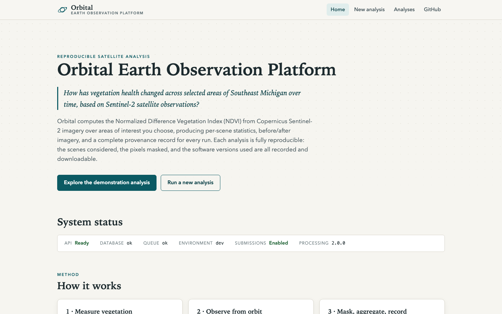
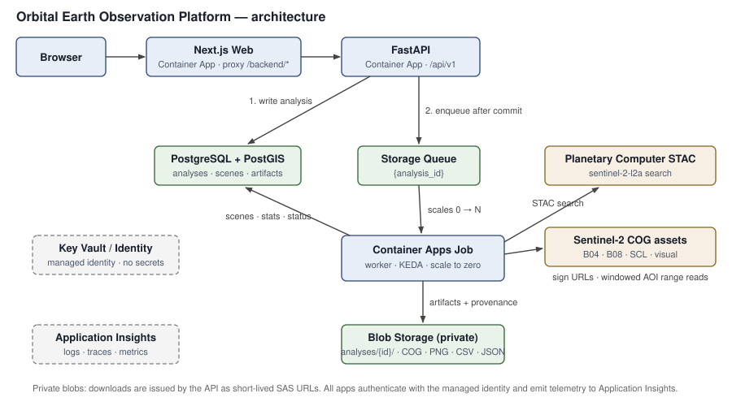
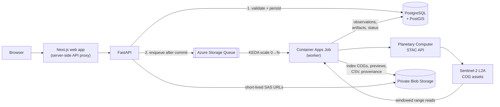

# Orbital Earth Observation Platform

**How has vegetation health changed at a given place over time, based on
Sentinel-2 satellite observations?**

Built around Southeast Michigan — still the home focus and the demonstration
analysis — and now shipping curated regions across six continents, anywhere
Sentinel-2 observes.

A reproducible environmental observation platform that turns that question into
auditable measurements: it discovers Sentinel-2 scenes through the Microsoft
Planetary Computer STAC API, applies documented cloud masking, computes NDVI
(vegetation health) or NBR (burn severity) over user-selected areas of
interest, and publishes every result with
machine-readable provenance — from the exact source scenes and mask policy down
to the SHA-256 of every output file.





## What it does

- **Interactive analyses** — pick one of the fifteen curated regions or draw your
  own area (capped at 250 km², a ceiling set from measured processing cost),
  choose the operation — NDVI for vegetation health, NBR for burn severity —
  plus a date range and cloud-cover threshold, and submit. The API queues the
  work; an event-driven worker processes it and the UI tracks
  `queued → running → succeeded/failed` live.
- **Works wherever Sentinel-2 looks** — the mission images land between roughly
  56°S and 83°N (not the poles, not open ocean). Within that band the canonical
  analysis grid selects the correct UTM zone automatically, in either
  hemisphere, and mosaics however many granules the area spans — verified on
  regions in Egypt, Brazil, Botswana, Vietnam, California, and Spain.
- **Real science, efficiently** — only the raster windows covering your AOI are
  read from cloud-optimized GeoTIFFs (no full-scene downloads). The Scene
  Classification Layer masks clouds, shadows, cirrus, and snow under a
  documented, configurable policy, and the Sentinel-2 processing-baseline
  reflectance offset is handled explicitly (it does *not* cancel in a
  normalized-index ratio — NDVI or NBR alike).
- **Comparable observations** — every analysis derives one canonical grid (CRS,
  resolution, transform, AOI mask) and every date is reprojected onto it, with
  granules mosaicked when the area crosses a Sentinel-2 tile boundary. Dates
  covering less than 99% of the area are rejected rather than silently
  compared against fuller ones.
- **Deterministic scene selection** — when more acquisitions match than the
  limit, a documented temporal-stratified lowest-cloud algorithm picks the set,
  and every exclusion is recorded with its reason.
- **Full provenance** — each analysis ships a JSON provenance document
  (validated against a published schema) with STAC item IDs, unsigned asset
  references, mask classes, band scaling, software versions, git commit,
  container image, CRS/transform per output, checksums, and timings.
- **Downloadable outputs** — per scene: float32 index COG (NDVI or NBR,
  rio-cogeo validated), colorized preview, source true-color preview,
  summary JSON; per analysis: time-series CSV (actual observation dates, never
  interpolated), change map (ΔNDVI or ΔNBR between the earliest and latest
  usable observations), summary JSON, provenance JSON.

> **Interpretation note** — results are *observed spectral vegetation-index
> changes* for specific acquisition dates. Neither NDVI nor NBR alone
> establishes drought, wildfire damage, climate change, or agricultural
> failure — a ΔNBR drop over forest is consistent with burning, not proof of
> it. See
> [docs/limitations.md](docs/limitations.md).

## Curated regions

Fifteen predefined regions ship with the platform, most sized between 120 and
160 km² so processing cost is comparable between them (Hartwick Pines Forest is
smaller, at ~84 km²). Michigan is the home ground;
together the fifteen span six continents, both hemispheres, and very different
vegetation regimes — including five documented wildfire burn scars for
pre/post-fire NBR analyses. Every one was checked for real Sentinel-2 coverage.

**Michigan**

| Region | What the landscape does |
| --- | --- |
| Southeast Michigan Demonstration Region | Suburban Oakland County — deciduous cover, turf, wetlands, and pavement in one strong seasonal cycle. Subject of the committed demonstration analysis. |
| Detroit Urban Core | Dense impervious surface holds baseline NDVI low; parks, street trees, and Belle Isle supply the contrast. |
| Sleeping Bear Dunes Shoreline | Bare sand and water at near-zero and negative NDVI, directly against vegetated dune and forest. |
| Hartwick Pines Forest | Conifer cover, with a seasonal swing damped next to the deciduous regions. |

**Global**

| Region | What the landscape does |
| --- | --- |
| Nile Delta Farmland (Egypt) | Irrigated cropland meeting desert — one of the sharpest NDVI gradients on Earth. Spans three Sentinel-2 tiles, mosaicked onto one grid. |
| Amazon Deforestation Frontier (Rondônia, Brazil) | The "fishbone" of roads and clearings cut into rainforest: intact canopy against pasture. |
| Central Valley Cropland (California) | Intensive irrigation on independent field calendars — neighbouring parcels at opposite NDVI extremes on the same day. |
| Okavango Delta (Botswana) | A seasonal flood pulse arriving months after the rains that caused it, so vegetation response is offset from the calendar. |
| Mekong Delta Rice (Vietnam) | Two to three crops a year, so NDVI cycles several times within one; flooded fields before transplanting read near-zero or negative. |
| Doñana Wetlands (Spain) | A Mediterranean wetland drying markedly through summer, beside irrigated agriculture that does not. |

**Wildfire**

| Region | What the landscape does |
| --- | --- |
| Park Fire Burn Scar (California) | Mixed conifer and chaparral in the Sierra Nevada foothills between Mill Creek and Deer Creek; in July 2024 the Park Fire turned dense canopy into charred slopes on its run from Chico toward Lassen Volcanic National Park. |
| Evia Burn Scar (Greece) | Aleppo pine and maquis on northern Evia near Istiaia; over ten days in August 2021 the fire swept the island's north coast to coast, leaving open, charred hillsides where closed-canopy pine stood. |
| Longwood Burn Scar (Victoria, Australia) | Eucalypt foothill forest and grazing country in the Strathbogie Ranges south of Longwood; the January 2026 fire, fanned southeast from the Hume Highway by northwesterly winds, burned more than 135,000 hectares of the ranges before containment on 19 January. |
| El Hoyo Burn Scar (Chubut, Argentina) | Andean-Patagonian forest and shrub-steppe in the Epuyén valley near El Hoyo; fires that broke out on 5 January 2026 and flared again late that month burned through the lake district's forested valleys. |
| Ávila Burn Scar (Castilla y León, Spain) | Pine forest and scrub on the northern slopes of the Sierra de Gredos above the Valle del Tiétar, between Mijares and Casillas; the fire declared at Burgohondo on 22 July 2026 became the largest wildfire in Spain's recorded history. |

These describe what the *landscape* does, not what the platform concludes: it
measures spectral indices (NDVI, NBR) and reports observed change (see the
interpretation note above).
Regions are exposed by `GET /api/v1/regions`, each carrying a `group` field.

## Data source

[Sentinel-2 Level-2A](https://planetarycomputer.microsoft.com/dataset/sentinel-2-l2a)
surface reflectance (ESA / Copernicus), accessed via the Microsoft Planetary
Computer STAC API. Bands used: B04 (red, 10 m) and B08 (NIR, 10 m) for NDVI,
B12 (SWIR2, natively 20 m, resampled onto the 10 m grid) for NBR, SCL (scene
classification, 20 m) for masking, and the true-color composite for previews.

*Contains modified Copernicus Sentinel data, processed by ESA, accessed via the
Microsoft Planetary Computer.*

## Architecture


```mermaid
flowchart LR
    B[Browser] --> W["Next.js web app<br/>(server-side API proxy)"]
    W --> A[FastAPI]
    A -->|"1. validate + persist"| P[("PostgreSQL<br/>+ PostGIS")]
    A -->|"2. enqueue after commit"| Q[["Azure Storage Queue"]]
    Q -->|"KEDA scale 0→N"| J["Container Apps Job<br/>(worker)"]
    J --> S["Planetary Computer<br/>STAC API"]
    S --> C["Sentinel-2 L2A<br/>COG assets"]
    C -->|"windowed range reads"| J
    J -->|"index COGs, previews,<br/>CSV, provenance"| BL[("Private Blob Storage")]
    J -->|"observations,<br/>artifacts, status"| P
    A -->|"short-lived SAS URLs"| BL
```

Details: [docs/architecture.md](docs/architecture.md) ·
[docs/scientific-methodology.md](docs/scientific-methodology.md) ·
[docs/data-provenance.md](docs/data-provenance.md)

## Quick start (local, no Azure account)

Prerequisites: Docker (with compose v2), [uv](https://docs.astral.sh/uv/),
Node 22+ with pnpm (via `corepack enable`), GNU make.

```bash
make bootstrap    # install Python + web dependencies, create .env
make dev          # start PostGIS, Azurite, API, worker, web
make migrate      # apply database migrations
make seed         # seed the predefined regions (Michigan + global + wildfire)
```

Open http://localhost:3000 (web) and http://localhost:8000/docs (API).

Run a real analysis end to end (fetches live Sentinel-2 data):

```bash
make demo               # submit + wait for the demonstration analysis
make live-smoke-test    # standalone one-scene pipeline check
```

Everything else:

```bash
make test         # Python test suite (no services needed)
make lint         # ruff + web lint        make typecheck  # mypy + tsc
make verify       # the complete local validation suite
make down         # stop the stack         make clean     # stop + delete volumes
```

Troubleshooting and operational tasks: [docs/operations.md](docs/operations.md).

## API

Interactive docs at `/docs`. Versioned under `/api/v1`; errors are RFC 7807
`application/problem+json`.

```bash
# Submit an analysis over a predefined region
REGION=$(curl -s localhost:8000/api/v1/regions | jq -r '.[] | select(.slug=="southeast-michigan-demo").id')
curl -s -X POST localhost:8000/api/v1/analyses \
  -H 'Content-Type: application/json' \
  -d "{\"region_id\":\"$REGION\",\"start_date\":\"2024-05-01\",\"end_date\":\"2024-09-30\",\"max_cloud_cover_pct\":20}" | jq .id

# Follow it
curl -s localhost:8000/api/v1/analyses/<id> | jq .status
curl -s localhost:8000/api/v1/analyses/<id>/timeseries | jq '.points[] | {observed_at, ndvi_mean}'
curl -s localhost:8000/api/v1/analyses/<id>/provenance | jq .scene_selection
```

## Example result (real data)

The committed demonstration analysis covers the Southeast Michigan
Demonstration Region (~137 km² of Oakland County) from April to October 2024 —
six low-cloud Sentinel-2 acquisitions showing the seasonal green-up and early
senescence. Every one is a mosaic of two granules spanning the UTM zone 16/17
boundary, computed on a single canonical grid so the dates are comparable:

| Observation | Mean NDVI | Valid pixels | Granules |
|-------------|-----------|--------------|----------|
| 2024-04-13  | 0.444     | 99.9 %       | 2 (T16TGN, T17TLH) |
| 2024-05-31  | 0.609     | 99.9 %       | 2 (T16TGN, T17TLH) |
| 2024-06-12  | 0.593     | 100.0 %       | 2 (T16TGN, T17TLH) |
| 2024-07-27  | 0.600     | 100.0 %       | 2 (T16TGN, T17TLH) |
| 2024-08-24  | 0.587     | 98.8 %       | 2 (T16TGN, T17TLH) |
| 2024-10-05  | 0.582     | 100.0 %       | 2 (T16TGN, T17TLH) |

The full bundle (previews, CSV, provenance) lives in
[`data/demo/southeast-michigan/`](data/demo/southeast-michigan/) and can be
imported into a fresh environment with `uv run oeop-admin import-demo`, so the
UI can display a completed result even where background processing is
unavailable.

## Azure deployment

The platform deploys to Azure Container Apps with Terraform — consumption-based,
scale-to-zero, no client secrets (GitHub OIDC + user-assigned managed
identities), private blob containers, VNet-private PostgreSQL, and Key Vault
for the only secret (the database URL).

```bash
az login && gh auth login          # a NON-production subscription
./scripts/bootstrap-azure-github.sh  # remote state, OIDC federation, GitHub vars
git push origin main                 # deploy-dev.yml takes it from there
```

The deploy workflow no-op-skips until the bootstrap variables exist, applies
foundation resources first, builds images in ACR tagged with the commit SHA,
then applies workloads, runs migrations, and smoke-tests the endpoints. See
[docs/deployment.md](docs/deployment.md), [docs/security.md](docs/security.md),
and [docs/cost-and-scaling.md](docs/cost-and-scaling.md).

## Repository structure

```
apps/          api (FastAPI), worker (queue consumer), web (Next.js)
packages/      earth_observation (science core), platform_core (settings/db/azure)
infra/         Terraform modules + dev environment
notebooks/     reproducible NDVI walkthrough using the same science package
docs/          methodology, provenance, architecture, security, operations, ADRs
scripts/       bootstrap-azure-github.sh, live_smoke_test.py, run_demo.sh
data/demo/     committed demonstration bundle (previews + metadata, attributed)
tests/         cross-cutting integration tests
```

## Testing strategy

- **Scientific unit tests** — synthetic rasters with analytically known NDVI:
  known values, negative NDVI, zero denominators, nodata propagation, cloud
  masking, AOI clipping, CRS transformation, misaligned grids, stats over
  valid pixels only, COG validity, deterministic selection, degenerate scenes.
- **Pipeline integration tests** — the real processing code path over tiny
  temporary GeoTIFFs (only the URL signer is substituted).
- **API tests** — contract, validation, problem-details, security headers.
- **Live smoke test** (`make live-smoke-test`) — one real Planetary Computer
  scene, excluded from the default suite.
- **Frontend** — vitest unit tests, strict TypeScript, Playwright smoke e2e.
- **CI** — lint, types, tests, builds, Terraform validate, secret scanning.

## Reproducibility

Locked dependencies (`uv.lock`, `pnpm-lock.yaml`), pinned container bases,
configuration snapshots stored per analysis, deterministic scene selection,
provenance documents with software versions and checksums, and a
[notebook](notebooks/ndvi_southeast_michigan.ipynb) that reproduces the science
with the same package the worker runs.

## Roadmap

- Additional indices (EVI, NDWI) on the same index-registry pipeline — NBR for
  burn severity already ships; the remaining two are configuration plus formula
- Region-pack import (GeoJSON upload) with server-side simplification
- Result caching keyed on (AOI, dates, config) to dedupe identical requests

## License & citation

MIT — see [LICENSE](LICENSE). Cite via [CITATION.cff](CITATION.cff); analyses
derive from Copernicus Sentinel-2 data (see attribution above).
