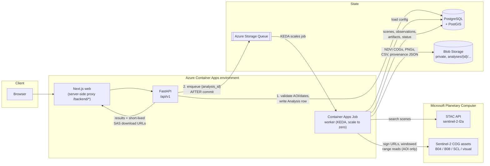
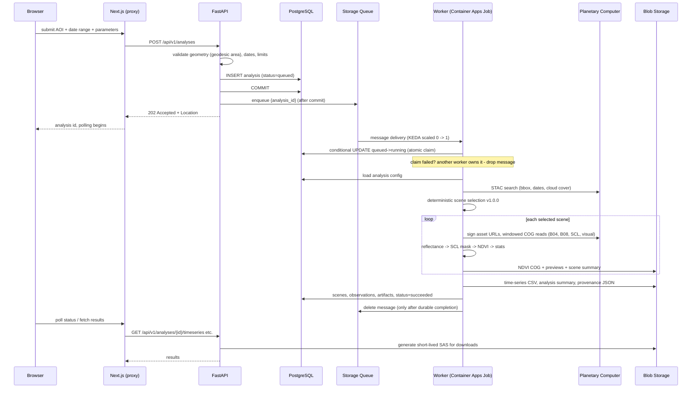

# Architecture

The Orbital Earth Observation Platform answers one scientific question:

> How has vegetation health changed across selected areas of Southeast Michigan
> over time, based on Sentinel-2 satellite observations?

It does so with a small, boring, reliable pipeline: a web UI submits an
analysis, an API validates and persists it, a queue decouples submission from
processing, and a scale-to-zero worker computes NDVI from cloud-optimized
Sentinel-2 assets, writing artifacts to private blob storage and structured
results to PostgreSQL.

Related documents:

- [Scientific methodology](scientific-methodology.md) — what the worker computes
  and why.
- [Data provenance](data-provenance.md) — what every run records.
- [Security](security.md) — threat model and controls.
- [Operations](operations.md) — runbook.
- [Deployment](deployment.md) — how it reaches Azure.
- [Architecture decision records](adr/) — why it is shaped this way.

A static rendering of the diagram below is in
[`images/architecture.svg`](images/architecture.svg).

## Components

| Component | Location | Role |
| --- | --- | --- |
| Web UI | `apps/web` | Next.js 15 + MapLibre + Recharts. Draw/select an AOI, submit an analysis, watch results. Calls the API only through its server-side proxy (`/backend/*`), so the browser never talks to the API origin directly. |
| API | `apps/api` | FastAPI service under `/api/v1`. Validates AOI and dates, persists `Analysis` rows, enqueues work, serves scenes/time series/artifacts/provenance, issues short-lived SAS download URLs. |
| Worker | `apps/worker` | Queue consumer. Runs as an Azure Container Apps Job (KEDA queue scaling, scale to zero) in Azure, or as a long-lived container locally. |
| Science core | `packages/earth_observation` | STAC search, deterministic scene selection, SCL masking, NDVI, COG/PNG outputs, statistics, provenance. No database or Azure dependencies; reusable from `notebooks/`. |
| Platform core | `packages/platform_core` (imported as `oeop_core`) | Settings (`OEOP_*` env), SQLAlchemy + PostGIS models, Azure blob/queue clients, structlog JSON logging, OpenTelemetry/Azure Monitor wiring. |
| Infrastructure | `infra/` | Terraform (azurerm): Container Apps + Jobs, PostgreSQL Flexible Server + PostGIS, Storage queues/blobs, Key Vault, ACR, Log Analytics + Application Insights, user-assigned managed identity, GitHub OIDC federation. |

## System flow

Key properties of the flow:

- **The browser only sees the web app.** The Next.js server proxies API calls,
  which keeps CORS tight and hides the API origin.
- **Submission is asynchronous.** `POST /api/v1/analyses` returns `202` with a
  `Location` header; processing happens out of band.
- **Only the AOI is read.** The worker performs windowed HTTP range reads
  against cloud-optimized GeoTIFFs (GDAL `/vsicurl`); full Sentinel-2 scenes
  are never downloaded.
- **Signed URLs are ephemeral.** Planetary Computer asset URLs are signed
  immediately before access and never persisted; provenance stores the
  original unsigned hrefs (see [data-provenance.md](data-provenance.md)).

## Analysis lifecycle

An analysis moves through the statuses `queued`, `running`, `succeeded`,
`failed`, and `cancelled`.

Failure paths:

- A deterministic failure (`user_input`, `data`, `internal` after a
  deterministic error, or `timeout` classification) marks the analysis
  `failed` with a category and sanitized message; the queue message is
  deleted so it is not retried pointlessly.
- A `transient` failure (network, remote service) is *not* marked failed on
  first occurrence: the worker lets the message become visible again and
  Azure Storage Queue redelivery retries it.
- `cancelled` is a terminal status set through administrative action.

## Reliability design

The queue and the database can disagree; the design makes every disagreement
converge safely.

| Mechanism | What it prevents |
| --- | --- |
| **Enqueue after commit** | A queue message pointing at an analysis row that was rolled back. The API commits the `Analysis` row first, then enqueues `{analysis_id}`. The rare opposite case (commit succeeds, enqueue fails) is recoverable via `oeop-admin requeue`. |
| **Atomic claim** | Two workers processing the same analysis. Claiming is a conditional `UPDATE ... WHERE status = 'queued'` (queued -> running); losers see zero rows updated and drop the message. |
| **Stale-lease reclaim** | Analyses stuck in `running` after a worker crash. A `running` row older than 2 hours can be reclaimed and reprocessed. |
| **Idempotent reprocessing** | Duplicate or partial outputs. Reprocessing deletes prior partial outputs for the analysis before writing, so at-least-once delivery yields exactly-once results. |
| **Visibility renewal** | Redelivery of a message that is still being legitimately processed. A background thread renews the queue message visibility timeout (default 300 s) during long runs. |
| **Poison queue** | Infinite retry loops. After 3 deliveries a message moves to the poison queue for human inspection. |
| **Delete after durable completion** | Losing work that appeared to finish. The queue message is deleted only after artifacts are uploaded and the terminal status is committed. |
| **Failure taxonomy** | Retrying the unretryable. `TransientError` is retried via redelivery; `user_input`, `data`, `timeout`, and `internal` failures are deterministic and never retried automatically (`packages/earth_observation/src/earth_observation/errors.py`). |

Manual recovery: `uv run oeop-admin requeue --analysis-id <uuid>` (see
[operations.md](operations.md)).

## Local vs Azure

The same containers run in both environments; only the wiring changes.

| Concern | Local (`docker compose`) | Azure |
| --- | --- | --- |
| Storage auth | Azurite emulator, connection string | User-assigned managed identity (no keys in app config) |
| Download SAS | Account-key SAS via Azurite | User-delegation SAS (15 min default) |
| Database | `postgis` container | PostgreSQL Flexible Server + PostGIS, private access |
| Worker | Long-lived container polling the queue (5 s) | Container Apps Job, KEDA queue-length scaling, scale to zero |
| Secrets | `.env` from `.env.example` | Key Vault + managed identity |
| CI/CD identity | n/a | GitHub OIDC federation — no client secrets anywhere ([ADR 0005](adr/0005-managed-identity-oidc.md)) |
| Telemetry | structlog JSON to stdout | Same JSON logs shipped to Log Analytics; OpenTelemetry to Application Insights |

Local development needs no Azure account: `make bootstrap`, `make dev`,
`make seed`, `make demo` run the full stack against Azurite and local
PostGIS. `make verify` runs lint, typecheck, and tests.

## Configuration

All limits are environment-configurable with the `OEOP_` prefix
(`packages/platform_core/src/oeop_core/settings.py`). Defaults:

| Limit | Default | Demo mode |
| --- | --- | --- |
| Max AOI area | 600 km² | 250 km² |
| Min AOI area | 0.5 km² | same |
| Max date span | 730 days | 400 days |
| Earliest start date | 2016-01-01 | same |
| Max scenes | 12 (default 6) | 8 |
| Cloud-cover threshold | ≤ 80 (default 20) | same |
| Job runtime | 1500 s | same |
| Per-analysis storage | 200 MB | same |
| Artifact retention | 30 days | same |
| Queue visibility timeout | 300 s | same |
| Queue poll interval | 5 s | same |

`DEMO_MODE` restricts submissions to predefined regions with tighter limits;
`submissions_enabled` is a kill switch (see
[operations.md](operations.md#disable-public-submissions)).
